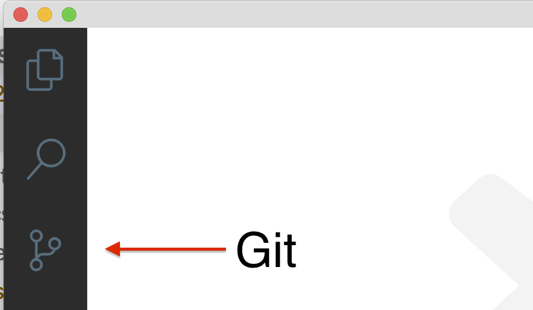
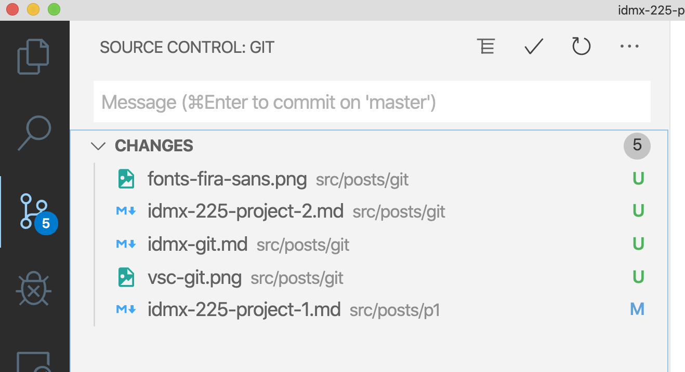

## VS Code Git Activity

Visual Studio Code has git support built in.

The main features are:

1. See the diff of the file you are editing in the gutter.

2. The Git Status Bar (lower left) shows the current branch, incoming and outgoing commits.

3. You can do the most common git operations from within the editor:

   1. Initialize a repository.

   2. Clone a repository.

   3. Stage and commit changes.

   4. Push/pull/sync with a remote branch.

To use Git inside VS Code, look for its icon on the left in the Activity Bar.

## Commit

When you select the Git icon, it displays the Git Commit input box. Notice the below example image, there is a number `5` circled over the icon. This shows that there are 5 files that have changed (created, edited, or deleted) and are ready to be committed. Write a commit message in the input box and then select the check mark icon to complete the commit.

## Push

Once files are committed, they should be pushed back to the remote repository. This is an important step because it takes advantage of the GitHubub's cloud storage.

To push your commit, select the 3-dot pull down menu and select `push`. If the local repository is correctly connected to the remote repository on GitHub, the changed files will be uploaded. It is best to have your GitHub repository open in a browser window. Refresh the page and make sure the the latest commit is shown.
